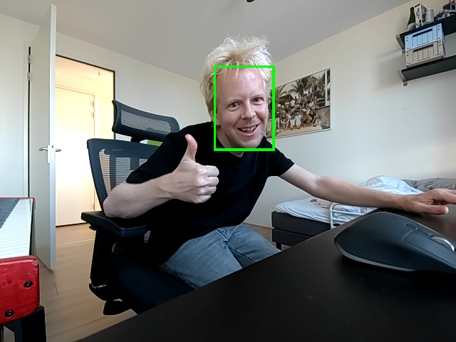

# Lightweight-Face-Detection AI Hub model on GPU/NPU

Demo of AI Hub's [Lightweight-Face-Detection](https://aihub.qualcomm.com/models/face_det_lite) running on GPU (crop/resize), and NPU (Neural Network) on Dragonwing development boards using the IM-SDK and LiteRT with AI Engine Direct delegates.

## Setup

1. Ensure your RB3 Gen 2 Development Kit or Rubik Pi development board runs Ubuntu 24; and has IM SDK and AI Engine Direct installed ([setup instructions](https://qc-ai-test.gitbook.io)).
2. Create a new venv, and install dependencies:

    ```bash
    python3.12 -m venv .venv
    source .venv/bin/activate
    pip3 install -r requirements.txt
    ```

3. Run the demo:

    **Built-in camera (RB3 Gen 2 Vision Kit):**

    ```bash
    # | grep -v "<W>" is optional (just filters out logs)
    python3 demo.py --video-source "qtiqmmfsrc name=camsrc camera=0" | grep -v "<W>"
    ```

    **USB Webcam:**

    ```bash
    # find device ID first...

    v4l2-ctl --list-devices
    # msm_vidc_media (platform:aa00000.video-codec):
    #         /dev/media0
    #
    # msm_vidc_decoder (platform:msm_vidc_bus):
    #         /dev/video32
    #         /dev/video33
    #
    # C922 Pro Stream Webcam (usb-0000:01:00.0-2):
    #         /dev/video2     <-- So /dev/video2
    #         /dev/video3
    #         /dev/media3

    # Run demo:
    # | grep -v "<W>" is optional (just filters out logs)
    python3 demo.py --video-source "v4l2src device=/dev/video2" | grep -v "<W>"
    ```

4. Images from the camera are stored in the `out/` directory.



## Performance

On RB3 Gen 2 Vision Kit on builtin camera 0:

```
Frame ready
    Data: name=frame (480, 640, 3)
    Faces: [[453, 33, 107, 149, 0.8500270247459412], [453, 35, 106, 147, 0.8500270247459412]]
    Timings: frame_ready_webcam→transform_done: 1.74ms, transform_done→pipeline_finished: 1.41ms, pipeline_finished→inference_done: 5.47ms (total 8.63ms)
```
