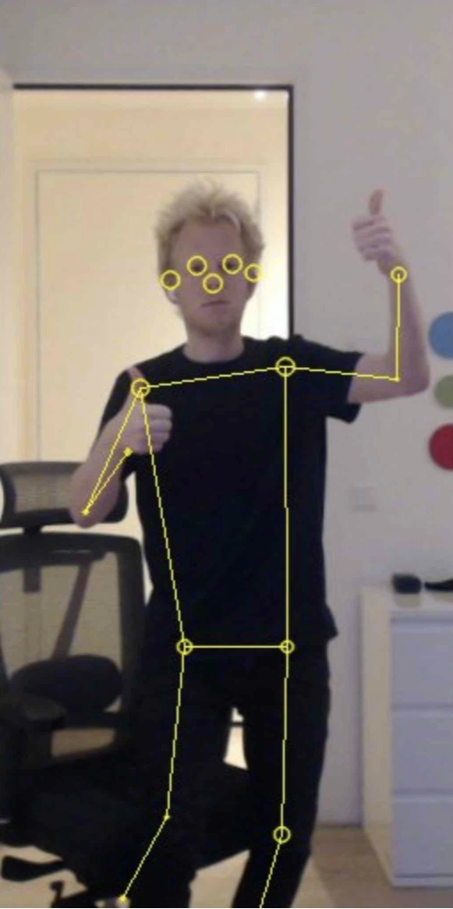

# Posenet-Mobilenet AI Hub model on GPU/NPU

Demo of AI Hub's [Posenet-Mobilenet](https://aihub.qualcomm.com/models/posenet_mobilenet) running on GPU (crop/resize), and NPU (Neural Network) on Dragonwing development boards using the IM-SDK and LiteRT with AI Engine Direct delegates.

## Setup

### Dragonwing development board

1. Ensure your Dragonwing development board runs Ubuntu 24.
2. Install GStreamer and the IM SDK:

    ```bash
    if [ ! -f /etc/apt/sources.list.d/ubuntu-qcom-iot-ubuntu-qcom-ppa-noble.list ]; then
        sudo apt-add-repository -y ppa:ubuntu-qcom-iot/qcom-ppa
    fi

    # Install GStreamer / IM SDK
    sudo apt update
    sudo apt install -y --no-install-recommends gstreamer1.0-tools gstreamer1.0-plugins-good gstreamer1.0-plugins-base gstreamer1.0-plugins-base-apps gstreamer1.0-plugins-qcom-good gstreamer1.0-plugins-bad

    # Install Python bindings for GStreamer, and build dependencies
    sudo apt install -y cmake build-essential v4l-utils libcairo2-dev pkg-config python3-dev libgirepository1.0-dev gir1.2-gstreamer-1.0 python3-gst-1.0
    ```

3. Create a new venv, and install Python packages:

    ```bash
    python3.12 -m venv .venv
    source .venv/bin/activate
    pip3 install -r requirements.txt
    ```

4. Run the demo:

    **Built-in camera (RB3 Gen 2 Vision Kit):**

    ```bash
    # | grep -v "<W>" is optional (just filters out logs)
    python3 -u demo.py --video-source "qtiqmmfsrc name=camsrc camera=0" | grep -v "<W>"
    ```

    **USB Webcam:**

    ```bash
    # find device ID first...

    v4l2-ctl --list-devices
    # msm_vidc_media (platform:aa00000.video-codec):
    #         /dev/media0
    #
    # msm_vidc_decoder (platform:msm_vidc_bus):
    #         /dev/video32
    #         /dev/video33
    #
    # C922 Pro Stream Webcam (usb-0000:01:00.0-2):
    #         /dev/video2     <-- So /dev/video2
    #         /dev/video3
    #         /dev/media3

    # Run demo:
    # | grep -v "<W>" is optional (just filters out logs)
    python3 -u demo.py --video-source "v4l2src device=/dev/video2" | grep -v "<W>"
    ```

5. Video incl. overlay are stored in the `out/` directory.



> **Note on frame rate:** Many webcams limit the frame rate on higher resolutions. E.g. Logitech C920 cameras only spit out 5fps at 1080p using `v4l2src`. You can downscale the resolution via e.g. `--video-input-width 640 --video-input-height 480` to force a lower resolution.

### Changing the output stream

Writing the output is done through a GStreamer pipeline (by default encoding to h264 and saving to a file). You can modify [demo.py](./demo.py)'s `output_pipeline` if you'd like to change the format or stream somewhere else (e.g. RTSP out).

## Webserver

For easy remote viewing you can also start a webserver. This spins up a simple webserver with a websocket connection, which streams images.

1. Start the server, e.g. via:

    ```bash
    python3 -u demo_webserver.py --video-source "v4l2src device=/dev/video3" --video-input-width 640 --video-input-height 480 | grep -v "<W>"
    ```

2. Open http://YOUR_IP:9300 (printed during startup) to see live predictions.

(Note: this adheres to the same format that Arduino App Lab uses for Edge Impulse models)

### macOS

1. Install GStreamer and libffi:

    ```bash
    brew install gstreamer libffi
    ```

2. Create a venv and install dependencies:

    ```bash
    # Create a new venv
    python3.12 -m venv .venv
    source .venv/bin/activate

    # Make sure libffi can be found (required for PyGObject)
    export PKG_CONFIG_PATH="/opt/homebrew/opt/libffi/lib/pkgconfig:$PKG_CONFIG_PATH"
    export CPATH="/opt/homebrew/opt/libffi/include:$CPATH"
    export LIBRARY_PATH="/opt/homebrew/opt/libffi/lib:$LIBRARY_PATH"

    # Install dependencies
    pip3 install -r requirements.txt
    ```

3. Run the demo:

    ```bash
    # List other cameras via 'gst-device-monitor-1.0 Video/Source'

    python3 demo.py --video-source "avfvideosrc device-index=0"
    ```

    Video incl. overlay are stored in the `out/` directory.

    

4. Or run the webserver via:

    ```bash
    python3 demo_webserver.py --video-source "avfvideosrc device-index=0"
    ```

    And open http://localhost:9300 to see live predictions.

> If you have issues with the built-in webcams, e.g. no images streaming anymore - run:

```bash
sudo killall VDCAssistant
```

## Troubleshooting

### No predictions

Make sure your camera handle is correct. E.g. camera ID (`/dev/videoX`) might actually change without unplugging your device.

### gst_parse_error: no element "h264parse" (1)

`h264parse` is in the `gstreamer1.0-plugins-bad` package. You can install it via:

```bash
sudo apt install -y gstreamer1.0-plugins-bad
```
